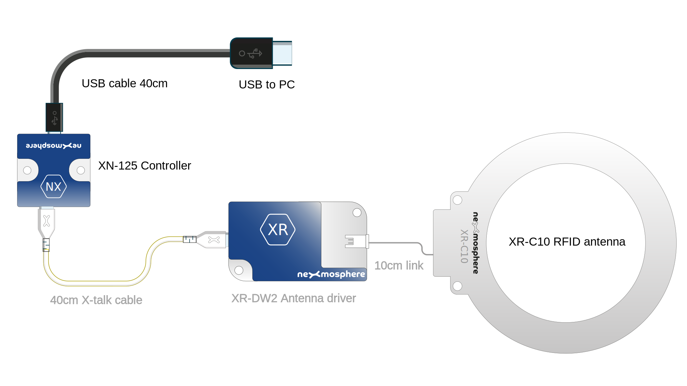

# RFID table: reader specifications and installation

This guide is for set builders looking to integrate a Nexmosphere RFID reader int built elements.

## Schematic

## Parts

A complete RFID reader system consists of the following parts:

### XR-CR10 10-centimetre RFID antenna

This is a circular PCB with a c. 100mm long cables on it. It needs to be mounted underneath the RFID detection zone - see below for further details.

See the [datasheet](https://static1.squarespace.com/static/6554c6b08c8bde3649fca4ed/t/66bf2cebea261169975d5e21/1723804908273/nexmosphere-xr-antenna-circular-datasheet.pdf) for full details.

### XR-DW2 RFID antenna driver: 

This connected to the antenna, and so will need to be mounted close to it. See [datasheet](https://static1.squarespace.com/static/6554c6b08c8bde3649fca4ed/t/66bcbb4959d61339c78c0a25/1723644747148/nexmosphere-xr-dw2-rfid-driver-datasheet.pdf) for full details.

### XN-125 X-talk interface board

This is connected to the XR-DW2 antenna driver with a 40cm x-talk cable and provides a USB connection for the host PC. See [datasheet](https://static1.squarespace.com/static/6554c6b08c8bde3649fca4ed/t/66bf4c3794fa39336ea51421/1723812921205/nexmosphere-xn-115_125-datasheet.pdf) for full details.

